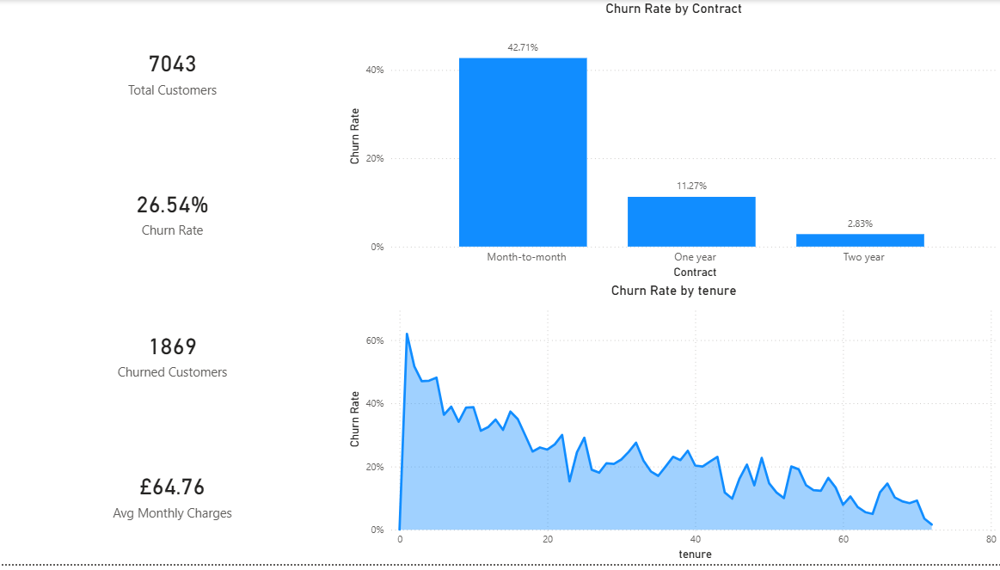

# customer_churn

Predicting customer churn for a telecommunications company using Python and visualising key insights through a Power BI dashboard. My goal is to identify which customers are most at risk of leaving and what factors drive that decision.
 
---------
 
## Dashboard Preview
 

 
---
 
## Project Overview
 
I used the IBM Telco Customer Churn dataset (7,043 customers, 21 features) and this project builds an end-to-end churn analysis pipeline which starts from raw data cleaning through to machine learning predictions and a business-ready Power BI dashboard.
 
**Business Question:** What is driving customer churn, and which customers are most at risk?
 
---
 
## Key Findings
 
- **26% overall churn rate** across the customer base
- **TotalCharges** was the strongest predictor of churn (feature importance: 0.14)
- **Month-to-month contract** customers churn at significantly higher rates than annual or two-year contract holders
- **New customers (first 12 months)** are the highest-risk group — churn drops sharply after tenure stabilises
- **Fibre optic internet** customers showed disproportionately high churn despite higher spend
 
---
 
## Models Used
 
| Model | ROC-AUC |
|---|---|
| **Logistic Regression** | **0.84** (it performed the best) |
| Random Forest | ~0.82 |
 
Logistic Regression outperformed Random Forest on this dataset, likely due to the relatively linear relationships between features and churn. An 80/20 stratified train-test split was used to preserve class balance.
 
---
 
## Project Structure
 
```
├── churn.ipynb   # Full analysis, modelling and evaluation
├── churn_powerbi.csv               # Cleaned dataset exported for Power BI
├── preview.png           # Power BI dashboard screenshot
└── README.md
```
 
---
 
## Methodology
 
**1. Data Cleaning**
- Fixed `TotalCharges` column stored as string with blank spaces instead of nulls
- Removed duplicate rows and dropped `customerID` (non-predictive)
- Standardised "No internet service" / "No phone service" values to "No"
- Converted `Churn` to binary (1 = churned, 0 = retained)
 
**2. Exploratory Data Analysis**
- Visualised churn rate across contract type, internet service, tenure, and payment method
- Built correlation heatmap across numeric features
- Created small multiples showing churn rate across 9 key categorical variables
 
**3. Feature Engineering**
- Created `ChargesPerMonth` (TotalCharges ÷ tenure) to capture value-per-month
- Created `IsNewCustomer` flag (tenure ≤ 12 months)
- Created `TotalServices` count per customer
- Label encoded binary columns, one-hot encoded multi-category columns
 
**4. Modelling**
- Benchmarked Logistic Regression vs Random Forest
- Evaluated using ROC-AUC, precision, recall, and confusion matrix
- Extracted feature importances to identify top churn drivers
 
---
 
## Power BI Dashboard
 
The dashboard includes 6 visuals built on the exported CSV:
 
- KPI cards that are : Total Customers, Churned Customers, Churn Rate, Avg Monthly Charges
- Churn rate by Contract Type
- Churn across customer tenure (area chart)
- Monthly charges vs churn status
- Churn by Internet Service type
- New vs Existing customer churn comparison
 
I also added an interactive slicer by Contract Type filters visuals simultaneously.
 
---
 
## Tools & Libraries
 
- **Python** - Pandas, NumPy, Matplotlib, Seaborn
- **scikit-learn** - Logistic Regression, Random Forest, train_test_split, metrics
- **Power BI**
- **Jupyter Notebook**
 
---
 
## Dataset
 
Dataset used - IBM Telco Customer Churn dataset which is available on [Kaggle](https://www.kaggle.com/datasets/blastchar/telco-customer-churn)
 
7,043 customer records covering demographics, account information, services subscribed, and churn status.
 
---
 
## Author
 
**Rutvik Randive**
MSc Data Science and Analytics — Cardiff University
[LinkedIn](https://www.linkedin.com/in/rutvik-randive-ab08a5232/) | [GitHub](https://github.com/samael-420)
